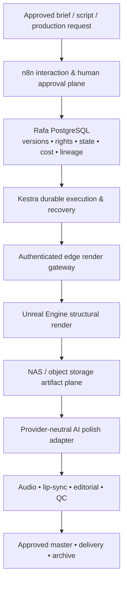

<div align="center">

# Rafa

### Governed cinematic & virtual-production operating system

**A software-defined production architecture for turning approved creative intent into repeatable, traceable, rights-aware media.**

[](./)
[](./Rafa%2000%20-%20Company%20%26%20Technical%20Master%20Requirements.md)
[](./Rafa%2001%20-%20Engineering%20Execution%20Manual.md)

</div>

---

## Overview

Rafa is a **software-defined cinematic and virtual-production company architecture** designed to convert approved briefs, assets, camera decisions, performances, and delivery requirements into controlled production outputs.

The operating model combines:

- **Rafa / PostgreSQL** as the authoritative system of record for projects, versions, rights, costs, lineage, approvals, and evidence.
- **n8n** for human interaction, intake, approvals, notifications, and selected external job lifecycles.
- **Kestra** for durable execution, retries, scheduling, dependency management, and recovery.
- An **authenticated edge render gateway** for private control of local rendering applications.
- **Unreal Engine** as a deterministic structural-rendering service rather than a game runtime.
- **NAS / object storage** for governed, versioned production artifacts.
- **Provider-neutral AI adapters** for controlled polish and variation.
- **Post-production, QC, rights, and release controls** for professional delivery.

The repository is a controlled documentation set covering company requirements, engineering, operations, people, business strategy, and financing plans.

> **Operating principle:** a status value alone is not completion. Rafa is designed around evidence, acceptance criteria, versioned artifacts, explicit ownership, and promotion gates.

---

## Start here

| If you are... | Read first | Why |
|---|---|---|
| Executive, founder, board member, or program lead | [Rafa 00 — Company & Technical Master Requirements](./Rafa%2000%20-%20Company%20%26%20Technical%20Master%20Requirements.md) | Defines the company architecture, system boundaries, requirements, stage gates, and governance model. |
| Engineer, architect, SRE, automation engineer, or Unreal specialist | [Rafa 01 — Engineering Execution Manual](./Rafa%2001%20-%20Engineering%20Execution%20Manual.md) | Converts the requirements into repositories, contracts, schemas, services, tests, delivery workflows, and assignable engineering work. |
| Operator, manager, commercial lead, or department owner | [Rafa 02 — Business Playbook](./Rafa%2002%20-%20Business%20Playbook%20%28Seven-Year%20Operating%20System%29.md) | Defines the seven-year operating system, commercial model, governance cadence, departments, scorecards, and roadmap. |
| IT, infrastructure, facilities, security, or service-management owner | [Rafa 03 — Operations Manual](./Rafa%2003%20-%20Operations%20Manual%20%28Five-Year%20Infrastructure%20%26%20Administration%29.md) | Covers identity, endpoints, network, storage, backup, facilities, procurement, service management, and continuity. |
| Hiring manager, People Ops, team lead, or new employee | [Rafa 04 — Recruiting, Hiring & 12-Month Onboarding Playbook](./Rafa%2004%20-%20Recruiting,%20Hiring%20%26%2012-Month%20Onboarding%20Playbook.md) | Defines structured recruiting, role scorecards, onboarding, certification, development, performance, and offboarding. |
| Angel or pre-seed investor | [Rafa 05 — Pre-Seed & Angel Business Plan](./Rafa%2005%20-%20Pre-Seed%20%26%20Angel%20Business%20Plan.md) | Frames an illustrative $1.75M pre-seed plan around gated technical and commercial proof. |
| Institutional seed / Series A investor | [Rafa 06 — Venture Capital Business Plan](./Rafa%2006%20-%20Venture%20Capital%20Business%20Plan.md) | Frames an illustrative $8.0M institutional financing plan around enterprise deployment, recurring revenue, and platform scale. |
| Strategic corporate or technology partner | [Rafa 07 — Strategic Investor Business Plan](./Rafa%2007%20-%20Strategic%20Investor%20Business%20Plan.md) | Frames an illustrative $35M minority strategic investment and commercial partnership program. |

---

## Documentation set

### Company foundation

| ID | Document | Scope |
|---|---|---|
| `RAFA-REQ-001` | **[Rafa 00 — Company & Technical Master Requirements](./Rafa%2000%20-%20Company%20%26%20Technical%20Master%20Requirements.md)** | Authoritative company requirements, architecture boundaries, organizational design, delivery gates, and traceability. |
| `RAFA-ENG-001` | **[Rafa 01 — Engineering Execution Manual](./Rafa%2001%20-%20Engineering%20Execution%20Manual.md)** | Implementation architecture, repository plan, contracts, schemas, code/config references, verification, engineering roles, and backlog. |

### Operating system

| ID | Document | Scope |
|---|---|---|
| `RAFA-BIZ-001` | **[Rafa 02 — Business Playbook](./Rafa%2002%20-%20Business%20Playbook%20%28Seven-Year%20Operating%20System%29.md)** | Seven-year strategy, business model, governance, department procedures, scorecards, planning cadence, and management controls. |
| `RAFA-OPS-001` | **[Rafa 03 — Operations Manual](./Rafa%2003%20-%20Operations%20Manual%20%28Five-Year%20Infrastructure%20%26%20Administration%29.md)** | Five-year IT, physical infrastructure, security, procurement, support, continuity, and administrative operating standard. |
| `RAFA-PEOPLE-001` | **[Rafa 04 — Recruiting, Hiring & 12-Month Onboarding Playbook](./Rafa%2004%20-%20Recruiting,%20Hiring%20%26%2012-Month%20Onboarding%20Playbook.md)** | Workforce planning, recruiting, structured selection, onboarding, certification, development, performance, and lifecycle controls. |

### Investment plans

| ID | Document | Intended audience | Illustrative capital request |
|---|---|---|---:|
| `RAFA-BP-ANGEL-001` | **[Rafa 05 — Pre-Seed & Angel Business Plan](./Rafa%2005%20-%20Pre-Seed%20%26%20Angel%20Business%20Plan.md)** | Founder-aligned angels, operators, creative-technology executives, and early strategic supporters | **$1.75M** |
| `RAFA-BP-VC-001` | **[Rafa 06 — Venture Capital Business Plan](./Rafa%2006%20-%20Venture%20Capital%20Business%20Plan.md)** | Institutional seed, Series A, media/AI infrastructure, and enterprise-software investors | **$8.0M** |
| `RAFA-BP-STRAT-001` | **[Rafa 07 — Strategic Investor Business Plan](./Rafa%2007%20-%20Strategic%20Investor%20Business%20Plan.md)** | Studios, broadcasters, enterprise media groups, cloud/GPU providers, creative-software companies, and strategic partners | **$35M** |

> The financing figures in the investment documents are explicitly presented as **illustrative planning scenarios**, not promises or verified forecasts. Each plan calls for replacement of assumptions with validated diligence data.

---

## Reference architecture



### Responsibility boundaries

| System | Owns | Does **not** own |
|---|---|---|
| **Rafa / PostgreSQL** | Canonical project, production, approval, rights, cost, lineage, and evidence records | Large media payloads or secret material |
| **n8n** | Human-facing interaction, approvals, notifications, selected external lifecycle work | Heavy compute or canonical production state |
| **Kestra** | Durable execution, task dependency, retries, scheduling, recovery | Creative approval or customer-facing UX |
| **Edge gateway** | Authenticated job control, local execution, process supervision, artifact verification | Business approval or provider-specific creative policy |
| **Unreal Engine** | Deterministic scene assembly and structural rendering | Workflow state, billing, rights, or cross-project policy |
| **Storage** | Durable, versioned production artifacts | Workflow decisions |
| **AI adapters** | Provider translation, job lifecycle, normalized result and cost capture | Canonical approval or rights decisions |
| **Editorial / QC** | Conformance, timeline, audio, release-quality decisions | Silent rewriting of upstream authoritative state |

---

## Delivery model

Rafa is intentionally **stage-gated**. The implementation roadmap moves from architectural control to atomic rendering, authoritative data, durable orchestration, human-directed workflows, provider-neutral polish, full post-production, pilot delivery, and finally scale readiness.

```text
G0  Company & architecture foundation
 ↓
G1  Repeatable atomic render
 ↓
G2  Authoritative data backbone & restore proof
 ↓
G3  Durable orchestration & failure recovery
 ↓
G4  Version-specific human approval workflow
 ↓
G5  Provider-neutral polish with bounded cost
 ↓
G6  End-to-end conformant release
 ↓
G7  Pilot quality, economics & repeatability
 ↓
G8  Scale readiness, SLOs, DR & operating maturity
```

This sequence is designed to prevent premature complexity and scaling before reliability, rights, evidence, and unit economics are proven.

---

## Core design principles

1. **Contract first** — define schemas, APIs, constraints, and artifact contracts before wiring systems together.
2. **One source of truth** — Rafa owns durable business and production state.
3. **Human approval is first-class** — approval remains explicit, version-specific, and auditable.
4. **Provider neutrality** — vendor-specific implementation details stay behind normalized adapters.
5. **Private edge control** — rendering workstations, databases, NAS administration, and Unreal control are not public endpoints.
6. **Immutable production versions** — approved manifests and artifacts are append-only; revisions create new lineage.
7. **Evidence before status** — success requires validated artifacts and persisted evidence.
8. **Rights travel with assets** — provenance, consent, restrictions, retention, and distribution eligibility are part of the production contract.
9. **Observability before scale** — quality, cost, latency, queue, reliability, and capacity must be measurable before concurrency grows.
10. **Recoverability by design** — retries, leases, backups, restores, runbooks, and failure states are part of the system architecture.

---

## Suggested reading paths

### Engineering implementation

`Rafa 00` → `Rafa 01` → architecture decisions → repository/ticket implementation → gate evidence

Focus on:

- system ownership and environment boundaries;
- PostgreSQL domain model and state transitions;
- production manifest and API contracts;
- edge gateway and Unreal automation;
- Kestra and n8n responsibilities;
- provider adapters and media QC;
- observability, FinOps, CI/CD, recovery, and security.

### Company operations

`Rafa 00` → `Rafa 02` → `Rafa 03` → `Rafa 04`

Focus on:

- company strategy and operating guardrails;
- offer ladder, pricing, governance, and decision rights;
- infrastructure, identity, service management, backup, and continuity;
- hiring gates, role scorecards, onboarding, certification, and performance.

### Investor diligence

Read the appropriate investment plan alongside `Rafa 00`, then use `Rafa 01–04` as the operating and implementation evidence base.

- **Pre-seed / angel:** prove the smallest reliable, governed production factory.
- **Institutional venture:** prove repeatable enterprise deployment, recurring economics, and product leverage.
- **Strategic investor:** combine minority investment with a separately governed commercial partnership while preserving Rafa IP, provider neutrality, and customer diversity.

---

## Document governance

The Rafa documentation set is intended to function as a controlled operating system rather than informal notes.

When changing the documentation:

- preserve document IDs and requirement IDs;
- distinguish editorial changes from requirement, architecture, production-emergency, and policy/legal changes;
- record rationale and downstream impact for material changes;
- keep architecture decisions, requirements, implementation work, tests, and evidence traceable;
- do not treat chat, screenshots, or memory as authoritative over approved source-controlled specifications;
- keep vendor- and version-specific claims subject to validation against the approved deployment.

---

## Repository status

This repository currently contains the **planning and implementation baseline** for Rafa. The documents describe intended architecture, requirements, operating controls, implementation patterns, and illustrative financing scenarios. Technical commands, vendor details, performance assumptions, financial assumptions, and legal positions must be validated in their applicable implementation or diligence context.

---

<div align="center">

**Stoneforge Labs · Rafa**

*Governed production. Versioned decisions. Evidence-based delivery.*

</div>
